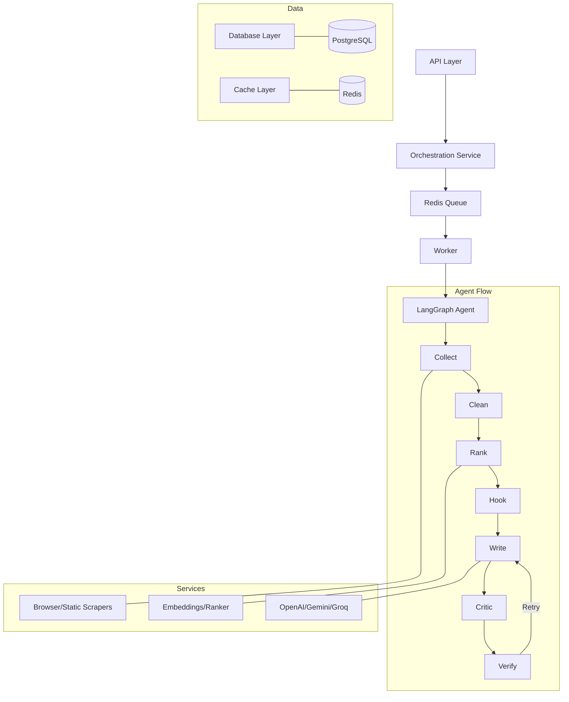

# PratibimbAI Backend 🚀

PratibimbAI is a production-grade Agentic AI system designed for professional content creators to mimic their voice and automate high-quality social media posts.

## 🏗 Architecture

The system is built on a domain-driven architecture for maximum scalability and contributor friendliness.



## 🌟 Key Features

- **Ghostwriter Mode**: Learns your specific writing style from samples using RAG.
- **Distributed Jobs**: Redis + RQ for scalable, asynchronous processing.
- **Fault-Tolerant Agents**: Node-level retry wrappers and verification loops.
- **Semantic Caching**: Avoids redundant scraping of the same URLs.
- **Structured Prompts**: Categorized prompts for generation, analysis, and ideation.
- **Multi-LLM Support**: Cost-optimized tiering across Groq, Gemini, and OpenAI.

## 🛠 Project Structure

- `app/api/`: FastAPI routes and schemas.
- `app/graph/`: LangGraph definitions, nodes, and retry wrappers.
- `app/services/`: Domain-driven services (Ingestion, LLM, Processing, Orchestration).
- `app/jobs/`: Job lifecycle management (Service, Repository, Worker).
- `app/prompts/`: Categorized prompt templates.
- `app/utils/`: Shared utilities (Tracing, Metrics, Cache, Auth).

## 🚀 Getting Started

### Local Development

1. **Clone the repo**
2. **Setup Virtual Env**
   ```bash
   cd backend
   python -m venv .venv
   source .venv/bin/activate
   pip install -r requirements.txt
   playwright install chromium
   ```
3. **Configure Environment**
   Copy `.env.example` to `.env` and fill in your keys.
4. **Run Stack**
   ```bash
   docker run -p 6379:6379 redis
   rq worker pratibimb_jobs
   uvicorn app.main:app --reload
   ```

## 📜 Documentation

Detailed documentation can be found in the `docs/` folder:
- [Architecture Overview](docs/architecture.md)
- [Agent Workflow](docs/agent-flow.md)
- [API Reference](docs/api.md)

## 🤝 Contributing

We welcome contributions! Please see our [Contributing Guide](CONTRIBUTING.md) to get started.